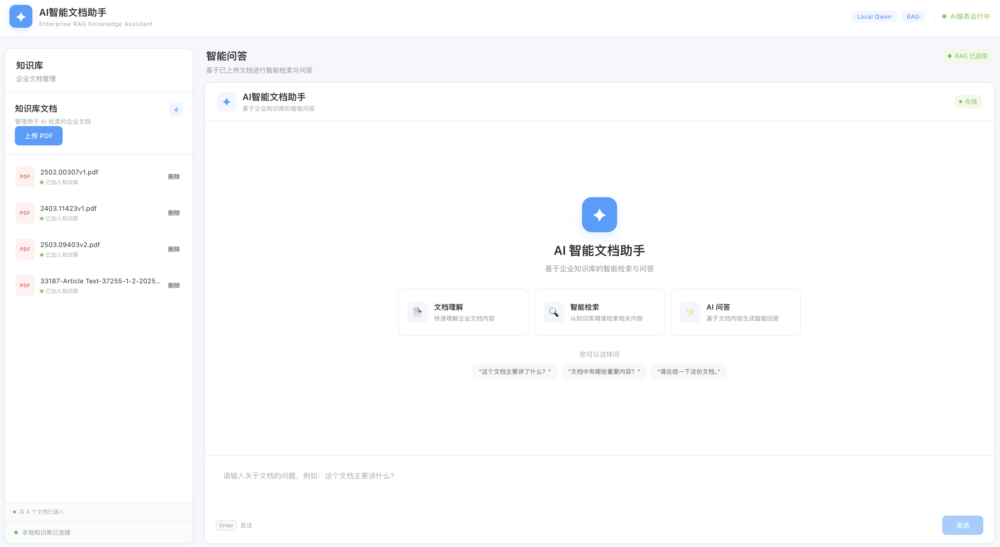

# Enterprise RAG Assistant

一个基于 FastAPI、Vue 3、ChromaDB、Sentence Transformers 和本地 Qwen LLM 构建的企业级文档智能问答系统。

项目实现了从 PDF 文档上传、文本解析、文本切分、向量化、语义检索，到基于检索结果进行大语言模型问答的完整 RAG（Retrieval-Augmented Generation）流程。

<p align="center">
  
</p>

<p align="center">
  <a href="./demo/RAE.mp4">
    <strong>▶️ 点击观看完整项目演示（14s）</strong>
  </a>
</p>

<p align="center">
  展示 PDF 文档上传、知识库构建、文档检索、AI 问答及回答结果生成流程
</p>

---

## 项目简介

Enterprise RAG Assistant 是一个本地运行的企业知识库问答系统。

用户可以上传企业 PDF 文档，系统会自动完成：

PDF 文档
→ 文本解析
→ 文本切分
→ Embedding 向量化
→ ChromaDB 向量存储
→ 语义检索
→ Qwen 大语言模型生成答案

系统同时提供 Web 前端，可以完成知识库文档管理和基于知识库的智能问答。

整个系统采用本地模型运行，不依赖付费的大模型 API。

---

## 核心功能

### 1. PDF 文档上传

支持通过 Web 界面上传 PDF 文档。

上传后的文件会保存到本地知识库目录。

### 2. PDF 文本解析

后端使用 PyMuPDF 对 PDF 文档进行文本提取。

### 3. 文本切分

将长文档切分为多个适合向量检索的文本片段。

### 4. 文档向量化

使用 Sentence Transformers 和：

BAAI/bge-small-zh-v1.5

将文本转换为向量。

### 5. 向量数据库

使用 ChromaDB 保存：

- 文档文本
- Embedding 向量
- 文件名等元数据

### 6. 语义检索

用户输入问题后，系统首先通过 Embedding 将问题转换为向量，然后从 ChromaDB 中检索相关文档片段。

### 7. 本地 LLM 问答

使用 Ollama 在本地运行：

qwen2.5:3b

将用户问题和检索到的相关文档作为上下文交给 Qwen，生成最终回答。

### 8. 文档来源展示

前端会展示 AI 回答所使用的相关文档片段，帮助用户了解回答的知识来源。

### 9. 知识库管理

支持：

- 查看已上传文档
- 上传 PDF
- 删除文档
- 删除对应向量数据

### 10. Web 前端

前端基于 Vue 3 + Vite 构建，提供：

- 企业知识库管理
- AI 智能问答
- Markdown 回答展示
- Loading 状态
- 错误状态
- 检索来源展示
- 响应式布局

---

## 系统架构

```text
                    ┌──────────────────────┐
                    │      Vue 3 前端      │
                    │                      │
                    │  文档管理 / AI问答   │
                    └──────────┬───────────┘
                               │ HTTP
                               ▼
                    ┌──────────────────────┐
                    │      FastAPI API     │
                    │                      │
                    │ Upload / Parse       │
                    │ Search / Chat        │
                    │ File Management      │
                    └───────┬───────┬──────┘
                            │       │
                 ┌──────────┘       └─────────────┐
                 ▼                                ▼
       ┌──────────────────┐             ┌──────────────────┐
       │   RAG Pipeline   │             │   Local Qwen     │
       │                  │             │                  │
       │ PDF Parsing      │             │ Ollama           │
       │ Text Splitting   │             │ qwen2.5:3b       │
       │ Embedding        │             │                  │
       │ Retrieval        │             └──────────────────┘
       └────────┬─────────┘
                │
                ▼
       ┌──────────────────┐
       │    ChromaDB      │
       │                  │
       │ Vector Storage   │
       │ Document Chunks  │
       │ Metadata         │
       └──────────────────┘